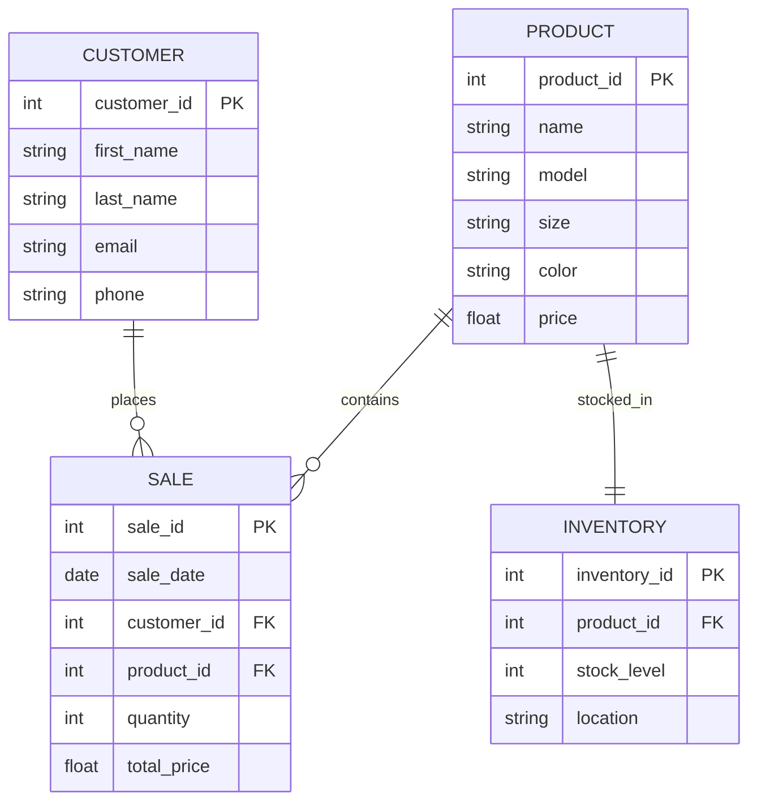

# Nike Store Entity Relationship Diagram

```mermaid
erDiagram
    CUSTOMER ||--o{ SALE : places
    PRODUCT ||--o{ SALE : contains
    PRODUCT ||--|| INVENTORY : stocked_in

    CUSTOMER {
        int customer_id PK
        string first_name
        string last_name
        string email
        string phone
    }

    PRODUCT {
        int product_id PK
        string name
        string model
        string size
        string color
        float price
    }

    SALE {
        int sale_id PK
        date sale_date
        int customer_id FK
        int product_id FK
        int quantity
        float total_price
    }

    INVENTORY {
        int inventory_id PK
        int product_id FK
        int stock_level
        string location
    }
```

